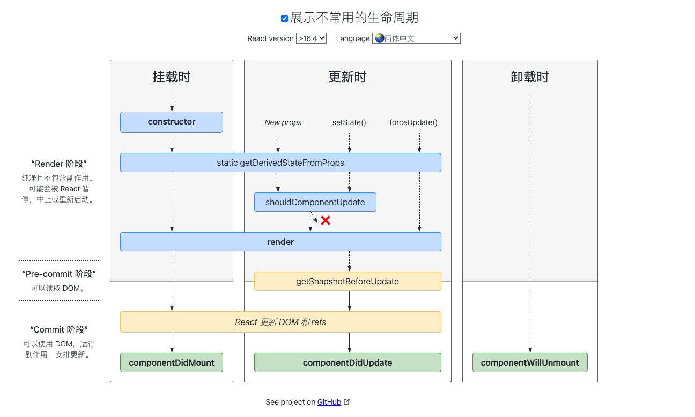

## 1. 分析下面js代码
```javascript
var l = 1;
var n = m = 0;
function myFun(x) {
    x = (x++) + 5;
}
n = myFun(l)
function anotherFun(x) {
    x = (--x) + 5;
}
m = anotherFun(n)
alert(n)
alert(m)
```
输出结果: undefined undefined
解: 两个函数都没有返回值

## 2. 不同浏览器获取按下键盘码的方式不同,不可能获取按下简码的是哪个?
```html
<input type="text" id="text" />
<script>
    document.getElementById("text").onkeypress = function(e){...}
</script>
```
A: this.keyCode
B: e.keyCode
C: window.event.keyCode;
D. e.charCode
解: A , 在firefox中, keyCode无法在onkeypress事件作用,为了相容,我们可以使用:`var x = event.which || event.keyCode;` `charCode`,`keyCode`是非标准的,逐渐被废弃,请使用`key`.`charCode`返回 `keypress` 事件触发时按下的字符键的字符Unicode值,`keyCode` 代表着一个唯一标识的所按下的键的未修改值，它依据于一个系统和实现相关的数字代码。这通常是与密钥对应的二进制的ASCII (RFC 20)或Windows 1252 码。如果这个键不能被标志，这个值为0。
`this`返回的是元素本身,没有keyCode

## 3.下面js语句中,a的值不是1的选项是?
A. var a = 1 && 3 && 1
B. var a = 1 && 2 && 3
C. var a = 1 || 0 || 3
D. var a = 0 || 1 || 2
解: B, &&运算的最后一项真值是3, 结果是3不是1

## 4.下面对于cookies,sessionStorage和localStorage的描述错误的是?
A. cookie数据始终在同源的http请求中携带(即使不需要),也会在浏览器和服务器间来回传递
B. sessionStorage和localStorage不会自动把数据发给服务器,仅在本地保存
C. cookie数据存储大小不能超过4K,而sessionStorage和localStorage存储没有大小限制
D. localStorage存储持久数据,浏览器关闭后数据不丢失除非主动删除数据,sessionStorage数据在当前浏览器窗口关闭后自动删除
解答: C. cookie存储大小一般为4KB, localStorage和sessionStorage的存储数据大小一般都是：5MB

## 5.请简单描述一下react组件的生命周期以及生命周期函数
解答: 
    React的组件在第一次挂载的时候首先获取父组件传递的props,  接着获取初始的state值,  接着经历挂载阶段的三个生命周期函数,也就是ComponentWillMount,render,ComponentDidMount,这三个函数分别代表组件将会挂载,组件渲染,组件挂载完毕三个阶段.  在组件挂载完毕后,组件的props和state的任意改变都会导致组件进入更新状态, 在组件更新阶段,如果是props改变,则进入ComponentWillReceiveProps函数,接着进入ComponentShouldUpdate进入判断是否需要更新,如果state改变这直接进入ComponentShouldUpdate判定,这个默认是true,当判定不需要更新的话,组件继续运行,需要更新的话,则一次进入ComponentWillUpdate, render, ComponentDidUpdate三个函数,当组件卸载时,会首先进入生命周期函数ComponentWillUnmount 之后进行卸载.




[16.3版本之后的生命周期流程图](https://projects.wojtekmaj.pl/react-lifecycle-methods-diagram/)


## 6.请简述一下react中的虚拟DOM以及虚拟DOM的对比规则
解答: 虚拟DOM是对真实DOM的抽象,以js对象作为基础的树,用对象属性来描述节点,最终可以通过一系列操作将这棵树映射到真实环境上.
通过使用diff算法来进行对比,diff算法有三种优化形式:
tree diff: 将新旧两个DOM树按照层级遍历,只对同级的DOM节点进行比较,即同一父节点下的所有子节点,当发现节点已经不存在,则该节点及其子节点会被完全删除,不会进一步比较.
component diff: 不同组件之间的对比,如果组件类型相同,暂不更新,否则删除旧的组件,再创建一个新的组件,插入到删除组件的位置
element diff: 在类型相同的组件内,在继续对比组件内部的元素

## 7.react中获取真实dom的方法是?
解答: ReactDOM.findDOMNode() 或 通过 ref

## 8.请简述一下setState的流程
解答: 在代码中调用setState函数之后,react会将传入的参数对象与组件当前的状态合并,然后触发所谓的*调和过程*(Reconciliation, 其目的是在用户无感知的情况下将数据的更新体现到UI上。).经过调和过程,React会以相对高效的方式根据新的状态构建React元素树并且着手重新渲染整个UI界面.在React得到元素树之后,React会自动计算出新的树和老树的节点差异,然后根据差异对界面进行最小量从渲染,在差异计算算法中,React能够相对精确地知道那些位置发生了改变以及应该如何改变,这就保证了按需更新,而不是全部重新渲染.

## 9.简述一下对react高阶组件的了解
解答: 高阶组件接受react组件作为参数,并且返回一个新的react组件,高阶组件本质上也是一个函数,并不是一个组件


## 10.redux是js应用的状态容器,提供可预测的状态管理(并不基于react)
三大原则: 单一数据源, state是只读的, 使用纯函数来执行修改

## 11.简述一下react-router中Link和NavLink组件之间的区别
解答: Link和NavLink 的区别就是一个点击的时候进行跳转,另一个点击之后还会额外加一个类名,可以控制样式.如果要修改class明的话,就用activeClassName='xxx'

## 12.简述一下ts中的类装饰器与方法装饰器的区别
解答: 方法装饰器表达式会在运行时当做函数被调用,传入下列3个参数
    1. 对于静态成员来说是类的构造函数,对于实例成员是类的原型对象
    2. 成员的名字
    3. 成员的属性描述符
类装饰器表达式会在运行时当做函数被调用,类的构造函数作为其唯一的参数

## 13.ts中的typeof 与js中的有什么区别
解答: ts中除了与js中相同的通过typeof判断类型外,还可以直接将类型提取,作为类型使用.

## 14.解释一下什么是纯函数
解答: 一个函数的返回结果只依赖于它的参数,并且在执行过程里面没有副作用,我们就把这个函数叫作纯函数.这么说肯定比较抽象,分来开讲:
* 函数的返回结果只依赖于它的参数
* 函数执行过程里面没有副作用

## 15.介绍一下Vue数据双向绑定的实现原理
Vue的数据双向绑定指的是,vue实例中的data与其渲染的dom元素的内容保持一致,无论谁被改变,另一方会相应的更新相同的数据.
    1. vue实现数据双向绑定的原理 Object.defineProperty()
    2. vue实现双向绑定的主要步骤:
       1. 需要observe的数据对象进行递归遍历,包括子属性的对象,都加上setter和getter,这样的话,给这个对象的某个值赋值,就会触发setter,那么就能监听到数据的变化
       2. compile解析模板指令,将模板中的变量替换成数据,然后初始化渲染页面视图,并将每个指令对应的节点绑定更新函数,添加监听数据的订阅者,一旦数据有变动,收到通知,更新视图.
       3. Watcher是Observer和Compiler之间通信的桥梁,主要做的事情是: 在自身实例化时往属性订阅器(dep)里面添加自己; 自身必须有一个update()方法; 待属性变动dep.notice()通知时, 能调用自身的update()方法, 并触发compile中绑定的回调
       4. mvvm作为数据绑定的入口,整合Observer,Compiler,和Watcher三者,通过Observer来监听自己的model数据变化,通过Compile来解析编译模板指令,最终利用Watcher搭起Observer和Compiler之间的通信桥梁,达到数据变化来更新视图,视图交互变化来更新数据model这样的 双向绑定效果
   

## 16.如何优化spa应用的首屏加载速度慢的问题
  1. 将公用的js库通过script标签外部引入,减小bundle大小,让浏览并行下载资源文件,提高下载速度
  2. 在配置路由时, 页面和组件使用懒加载的方式引入,进一步缩小bundle的体积,在调用某个组件时再加载对应的js文件
  3. 添加首屏loading效果,提升用户体验

## 17.vue在的key到底有什么用
key是给每一个vnode的唯一标识,依靠key,我们的diff错误可以更准确,更快速(对于简单列表页渲染来说diff节点也更快,但产生一些隐藏的副作用,比如可能不会产生过渡效果,或者在某些节点绑定数据状态,会出现状态错位)
diff算法的过程中,先会进行新旧节点的首尾交叉对比,当无法匹配的时候会用新节点的key与旧节点产生的key进行比对,进而找到相应旧节点.
更准确: 因为带key就不是就地复用了,在sameNode函数. a.key===b.key 对比中可以避免就地复用的情况,所以更加准确,如果不加key,会导致之前节点的状态被保留下来,可能产生一一些的Bug

## 18.vue中的route和router的区别是什么
route是路由信息对象,包括path,hash,query,fullPath,matched,name等路由信息参数
router是路由实例对象,包括了路由的跳转方法push,replace 钩子函数等

## 19. 如何优化webpack构建的性能
1. 减少代码体积
   1. 使用CommonsChunksPlugin提取多个chunk之间的通用模块,减少总代码体积
   2. 把部分依赖转移到cdn上,避免每次编译过程都由webpack处理
   3. 对一些组件库采用按需加载,避免无用的代码
2. 减少目录检索范围$$
   1. 用loader的时候,通过判定exclude和include选项,减少loader遍历的目录范围,从而加快webpack的编译速度
3. 减少检索路径, resolve.alias可以配置webpack模块解析的别名,对于比较深的解析路径,可以配置alias


